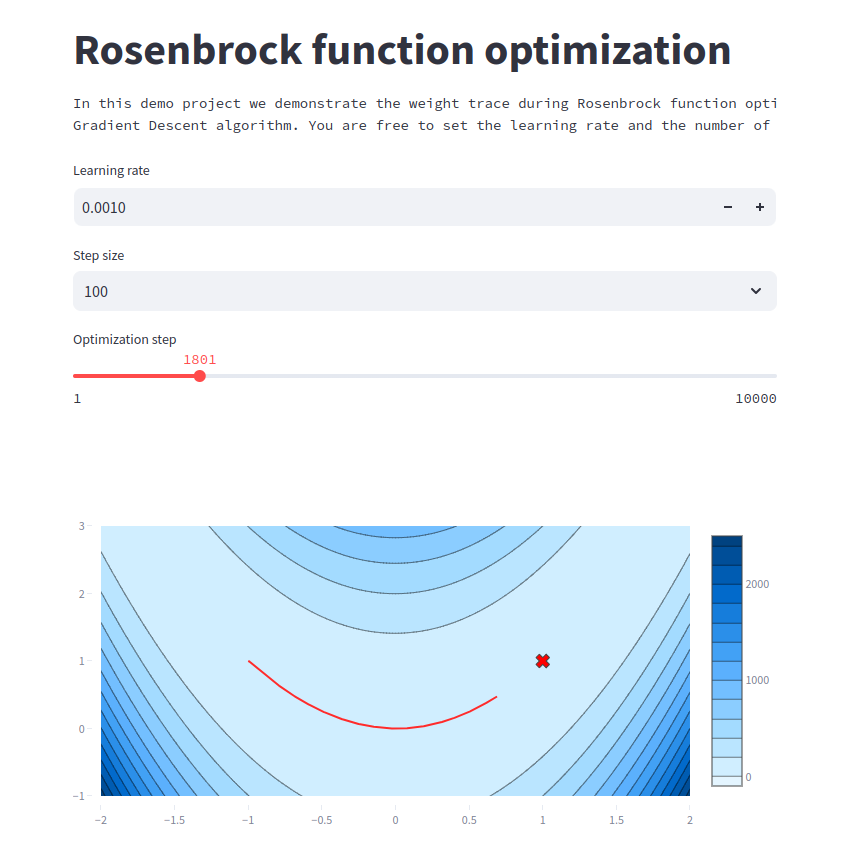

# Final assignment for the *02-tooling-for-data-scientist* sessions

## Demo-project: Demonstration of a minimization process of the Rosenbrock function.
In this project you can visualize the behaviour of the argument value change during the Rosenbrock function optimization
using the Gradient Descent algorithm.
Feel free to tweak related *Learning rate* and *Optimization step* widgets.

In order to run demo:
1) Clone the project and cd into the root of the project;
2) Build the dockerfile: ```docker build -t streamlit .```
3) Run the docker container: ```docker run -p 8501:8501 streamlit```

Finally, use this link to access the demo from your browser: http://localhost:8501


